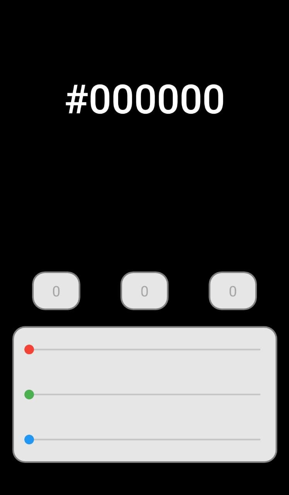
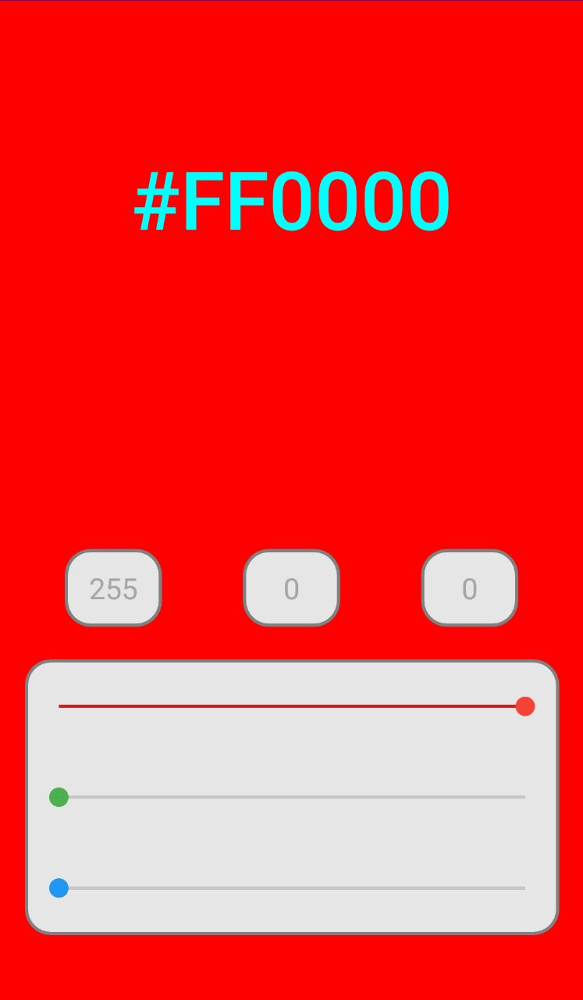
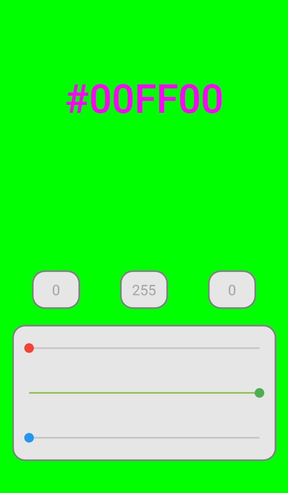
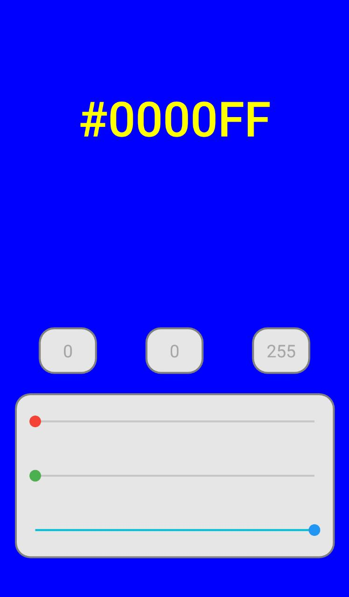
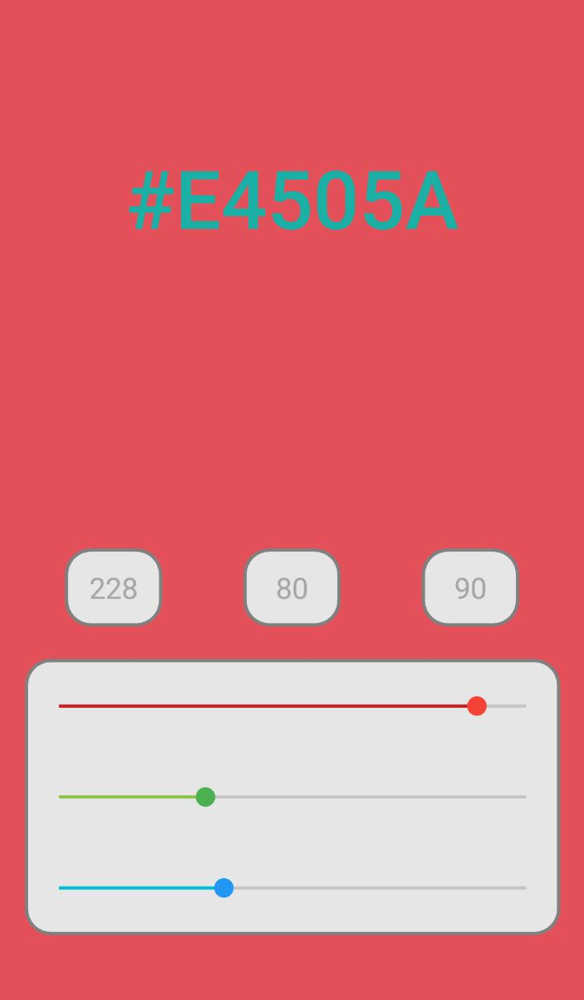
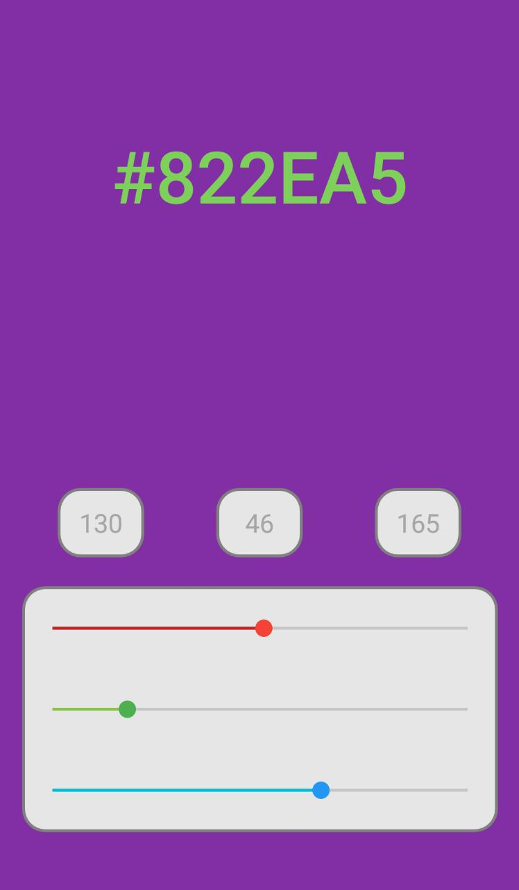
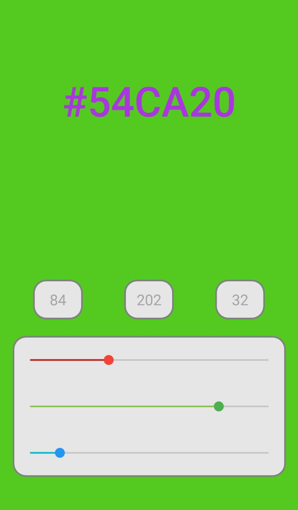
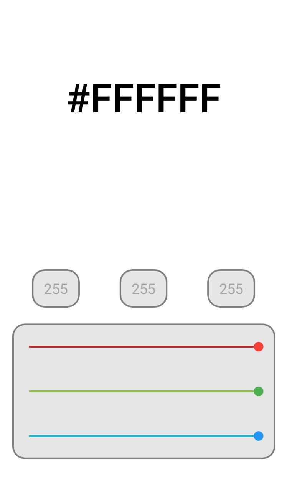

# ColorPick

The application developed in Android Studio, using Kotlin language, aims to provide RGB colors to the user, being possible to configure the color through seekbars and text boxes.

## Images

Here are some screenshots of the app working.

### Home screen

### Red screen

### Green screen

### Blue screen

### Mixed color screen (Example 1)

### Mixed color screen (Example 2)

### Mixed color screen (Example 3)

### White screen

